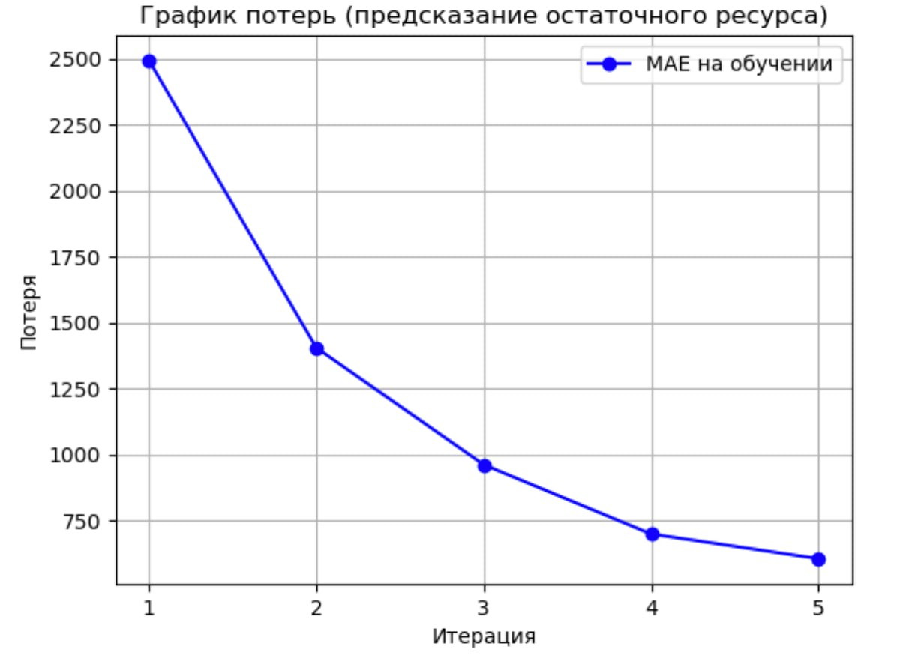

На основе предоставленных данных можно сделать несколько выводов и рассмотреть подходы к предсказанию поломок.

---

### 1. Анализ данных

#### Общая информация

- Данные содержат информацию о поломках блока розлива за период с 2020 по 2024 год.
- Каждая запись включает
  - Время начала и конца простоя.
  - Тип поломки (Reason 3 ID = 2010004, Breakdowns) - примем всё за один класс - поломки.
  - Описание проблемы.
  - Продолжительность простоя.

#### Основные типы проблем

- Замена дросселей, тормозных пластин, прижимных колпаков, сбросных дросселей.
- Устранение недоливов.
- Сбои в работе датчиков и программного обеспечения.
- Механические повреждения (например, заклинивание цепей или рычагов).

Обработав текст причин поломок, провели кластеризацию по длительности поломок. Результат от самого большего к меньшему представлен на диаграмме ниже


Резульат клатсеризации и группировки по средней и суммарной длительности поломок


> Кластер    Длительность
> 0               5.602675
>
> 1               3.181621
>
> 2               10.234375

Визуализация кластеров наглядно в зависимости от

#### Статистика

- Общий итог времени простоя 3,253 минуты.
- Частота замены компонентов указывает на их износ и необходимость профилактического обслуживания.

#### Анализ частоты поломок

Анализ частоты поломок проводился по количеству поломок в каждом классе

```python
# Подсчет частоты поломок для каждого типа элемента
frequency_by_element = data['Элемент'].value_counts()

# Топ-10 наиболее часто встречающихся причин поломок
top_10_elements = frequency_by_element.head(10)

```

* Вывели топ 10 самых часто встречающихся поломок. Отобразили на диаграмме


* Так же на круговой диаграмме, в % от общего числа поломок


---

### 3. Преобразование данных

Чтобы эффективно использовать эти данные для анализа или моделирования, необходимо их структурировать и подготовить

#### Шаг 1 Преобразование времени

- Конвертируем столбцы Начало простоя и Конец простоя в формат datetime.

  ```Python
  # Приведём время начала поломки в datetime
  kv = {
      'сен':'09',
      'окт':'10',
      'ноя':'11',
      'дек':'12',
      'янв':'01',
      'фев':'02',
      'мар':'03',
      'апр':'04',
      'май':'05',
      'июн':'06',
      'июл':'07',
      'авг':'08',
  }

  def replace_month(date_str):
      for month_abbr, month_num in kv.items():
          date_str = date_str.replace(month_abbr, month_num)
      return date_str


  data['Начало простоя'] = data['Начало простоя'].apply(replace_month)
  data['Конец простоя'] = data['Конец простоя'].apply(replace_month)


  data['Начало простоя'] = pd.to_datetime(data['Начало простоя'], format='%d-%m-%y %H:%M:%S')
  data['Конец простоя'] = pd.to_datetime(data['Конец простоя'], format='%d-%m-%y %H:%M:%S')
  ```

#### Шаг 2 Разделение описания

- Разбили столбец Описание на отдельные поля

  ```Python
  pattern = r'(?:Замена|устранение|не\s+работает|выбивает|залип|остановки|ремонт|заменена|замена|мех\.|кип)(.*?)(?:№|\b№№\b|#|:\s|на\s|по\s)(\d+(?:,\s*\d+)*)'

  # Функция для парсинга строки
  def parse_description(description):
  	try:
  		match = re.search(pattern, description, re.IGNORECASE)
  		if match:
  			element = match.group(1).strip()
  			numbers = match.group(2).replace('№', '').replace('#', '').strip() 
  			return element.lower(), numbers
  		return None, None
  	except TypeError:
  		return None, None

  data[["Элемент", "Номер"]] = data["Описание"].apply(lambda x: pd.Series(parse_description(x)))

  # Разделяем номера, если их несколько
  data = data.dropna(subset=["Номер"])  # Удаляем строки без найденных номеров
  # data["Номер"] = data["Номер"].str.split(',').explode().str.strip()

  # Выводим результат
  print(data[["Элемент", "Номер"]])

  # Сохраняем в CSV файл (если нужно)
  data[["Элемент", "Номер"]].to_csv("parsed_data.csv", index=False, encoding="utf-8")
  ```

  > Элемент                                        Номер
  > 0    двух дросселей на наполнителе    17
  > 1        первого ролика на столике        1
  > 2         нагнетательного дросселя         89
  > 3         нагнетательного дросселя         105
  > 4               тормозной пластины            76
  > ..                               ...                               ...
  > 504                       недолива                     71
  > 517                  тор. пластины                   63
  > 518                       дросселя                      33
  > 526             тормозной пластины            10
  > 527             тормозной пластины             66
  >

#### Шаг 3 Преобразование слов в леммы (Лемматизация)

- Означает привести слова к начальной форме, для уменьшьения количества классов из за различных форм слов в Описании

  ```Python
  morph = pymorphy2.MorphAnalyzer()


  def lemmatize_text(text):
      if not isinstance(text, str):  
          return ''
      words = text.split()  # Разделяем текст на слова
      lemmas = [morph.parse(word)[0].normal_form for word in words]  
      return ' '.join(lemmas)  

  data['Элемент'] = data['Элемент'].apply(lemmatize_text)
  ```

#### Шаг 4 Создание временных меток

- Добавили признаки дополнительные признаки

  - Месяц и день недели, когда произошла поломка.
  - Время суток (утро, день, вечер, ночь).
  - Интервал времени между последней заменой компонента и текущей поломкой.

  ```Python

  data['Начало простоя (часы)'] = data['Начало простоя'].apply(lambda x: x.split(' ')[1])
  data['Начало простоя (часы)'] = pd.to_datetime(data['Начало простоя (часы)'])

  def get_time_of_day(time):
      hour = time.hour
      if 6 <= hour < 12:
          return 'Утро'
      elif 12 <= hour < 18:
          return 'День'
      elif 18 <= hour < 24:
          return 'Вечер'
      else:
          return 'Ночь'


  data['Время суток'] = data['Начало простоя (часы)'].apply(lambda x: get_time_of_day(x))
  ```

#### Шаг 5 Подготовка для прогнозирования

- Создадим временной ряд, где каждая строка соответствует определенному моменту времени (например, день или месяц), а целевая переменная — количество поломок или общее время простоя.
- Так как в нашем случае приведены данные только для поломок, то для обучения модели нужно добавить шум в данные - путь этим шумом будет заполнение пропусков между поломками на нормальныый режим работы

```python
# сгенерируем данные

from datetime import timedelta

normal_periods = []

for i in range(len(data) - 1):
    end_of_breakdown = data.loc[i, 'Конец простоя']
    start_of_next_breakdown = data.loc[i + 1, 'Начало простоя']
  
    # Если между поломками есть разрыв, создаем нормальные периоды
    if start_of_next_breakdown > end_of_breakdown:
        current_time = end_of_breakdown
        step = timedelta(minutes=30)  # Шаг для создания нормальных периодов (например, 30 минут)
  
        while current_time + step <= start_of_next_breakdown:
            normal_start = current_time
            normal_end = current_time + step
            normal_periods.append((normal_start, normal_end))
            current_time += step

normal_df = pd.DataFrame(normal_periods, columns=['Начало простоя', 'Конец простоя'])

normal_df['Метка'] = 'Нормальный'

data['Метка'] = 'Поломка'

combined_df = pd.concat([data[['Начало простоя', 'Конец простоя', 'Метка']], normal_df], ignore_index=True)
```

#### Шаг 6: Балансировка данных

* Число классов "Поломка" и "Норма" слишкорм разное - нормальных меток больше, чем сломанных. Проведём балансировку классов

  ```python
  # проведём балансировку

  from sklearn.utils import resample

  # Разделяем данные на классы
  breakdown_data = combined_df[combined_df['Метка'] == 'Поломка']
  normal_data = combined_df[combined_df['Метка'] == 'Нормальный']


  normal_downsampled = resample(
      normal_data,
      replace=False, 
      n_samples=len(breakdown_data),  
      random_state=42
  )

  balanced_df = pd.concat([breakdown_data, normal_downsampled], ignore_index=True)


  balanced_df = balanced_df.sample(frac=1, random_state=42).reset_index(drop=True)

  print(balanced_df.head())
  ```
* Так как данные стабильны - "зашумим" их

  ```Py

  def add_noise_to_timestamps(timestamps, noise_level=5):
      """
      Добавляет случайный шум к временным меткам.
      :param timestamps: Pandas Series с временными метками.
      :param noise_level: Максимальное отклонение в минутах.
      :return: Pandas Series с измененными временными метками.
      """
      return timestamps + pd.to_timedelta(np.random.uniform(-noise_level, noise_level, size=len(timestamps)), unit='m')

  # Применяем функцию к нормальным периодам
  balanced_df.loc[balanced_df['Метка'] == 'Нормальный', 'Начало простоя'] = \
      add_noise_to_timestamps(balanced_df.loc[balanced_df['Метка'] == 'Нормальный', 'Начало простоя'])

  balanced_df.loc[balanced_df['Метка'] == 'Нормальный', 'Конец простоя'] = \
      add_noise_to_timestamps(balanced_df.loc[balanced_df['Метка'] == 'Нормальный', 'Конец простоя'])

  ```

  #### Описание алгоритма

  В данном анализе проведена обработка данных о простоях на производственном блоке разлива с целью выявления ключевых причин задержек и их группировки по схожим характеристикам. Для этого текстовые данные были:


  - очищены от лишних символов и цифр;
  - приведены к нижнему регистру;
  - очищены от неинформативных слов;
  - токенизированы (разбиты на отдельные слова, сохранены только значимые лексемы);
  - лемматизированы (приведены к нормальной форме).

  Далее тексты были векторизированы с помощью `CountVectorizer`, что позволило представить их в числовом виде, и кластеризованы на основе алгоритма `k-means`, чтобы сгруппировать простои по схожим причинам и выявить паттерны, позволяющие оптимизировать процессы.

  ---

  

  ### Интерпретация кластеров

  ##### Кластеры 0 и 4

  Средняя длительность простоев: около **16 минут**
  Описание: Связаны с переходами между процессами, сменой продукции и необходимостью переналадки оборудования. Это стандартные технологические задержки, которые могут быть оптимизированы за счет ускорения процессов настройки и улучшения планирования переходов.

  ---

  ##### Кластер 1

  Средняя длительность простоев: около **12 минут**
  Описание: Объясняются санитарными регламентами, обязательными мойками и очистками оборудования. Эти задержки неизбежны, но возможно их сокращение за счет использования более эффективных методов санитарной обработки или корректировки расписания их проведения.

  ---

  ##### Кластер 2

  Средняя длительность простоев: около **200 минут**
  Описание: Основные причины — неработающее оборудование, ожидание ремонта и заявок на техническое обслуживание. Это критическая зона для оптимизации, так как столь длительные простои указывают на возможные проблемы в системе технической поддержки и планировании ремонтных работ.

  ---

  ##### Кластер 3

  Средняя длительность простоев: около **9 минут**
  Описание: Включают организационные простоя, связанные с проверками, лабораторными тестами и другими контрольными мероприятиями. Процесс проверок относительно эффективен, однако возможно его дальнейшее сокращение за счет автоматизации или оптимизации регламентов.

  ---

  ##### Выводы и возможные направления оптимизации

  - **Наибольшие потери** связаны с нехваткой ресурсов и техническими проблемами (кластер 2). Оптимизация логистики и ускорение процесса подачи заявок на ремонт могут существенно снизить потери времени.
  - Кластер 4 требует оптимизации переходов между продуктами и сокращения времени стерилизации оборудования. Возможны улучшения за счет более эффективных методов очистки.
  - Санитарные обработки (кластер 1) и переналадки (кластер 0) — неизбежные процессы, но их можно улучшить путем внедрения более эффективных регламентов и технологий мойки.
  - Кластер 3 имеет наименьшую длительность простоев, но можно оценить возможность сокращения времени проверок за счет автоматизации тестирования.

---

### 2. Алгоритм предсказания поломок

Используемая модель – CatBoostClassifier (задача предсказания наличия поломки ), CatBoostRegressor (задача предсказания остаточного ресурса оборудования)

Для построения обеих моделей используются признаки: Время дня, день недели и время с последней поломки. Целевые переменные: есть ли поломка (0 – нет, 1 – есть), остаточный ресурс работы в минутах.

Полученные метрики:
Задача предсказания наличия поломки – f1 binary 0.767, precision 0.895, recall 0.671
Задача предсказания остаточного ресурса работы – R2 binary 0.862, MAE 793.417, MSE 4592782.153

ROC кривая для визуализации f1 - метрики




---

## Выводы - рекомендации

### 1. **Регулярное профилактическое обслуживание критических компонентов**

### **Оптимизация запасов запчастей**

### 3. **Автоматизация мониторинга состояния оборудования**

### 4. **Анализ сезонности и условий эксплуатации**
